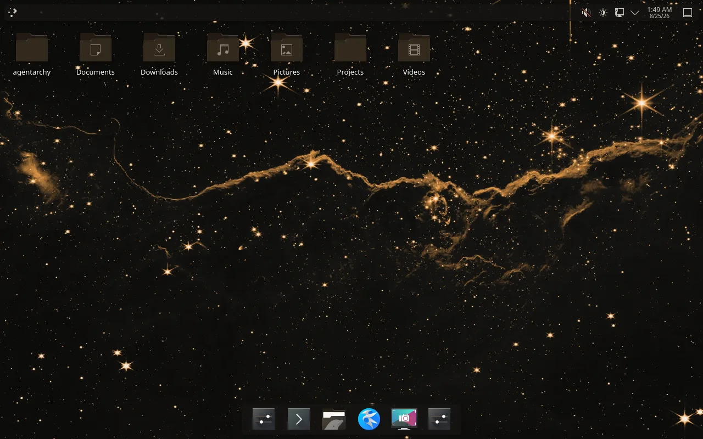
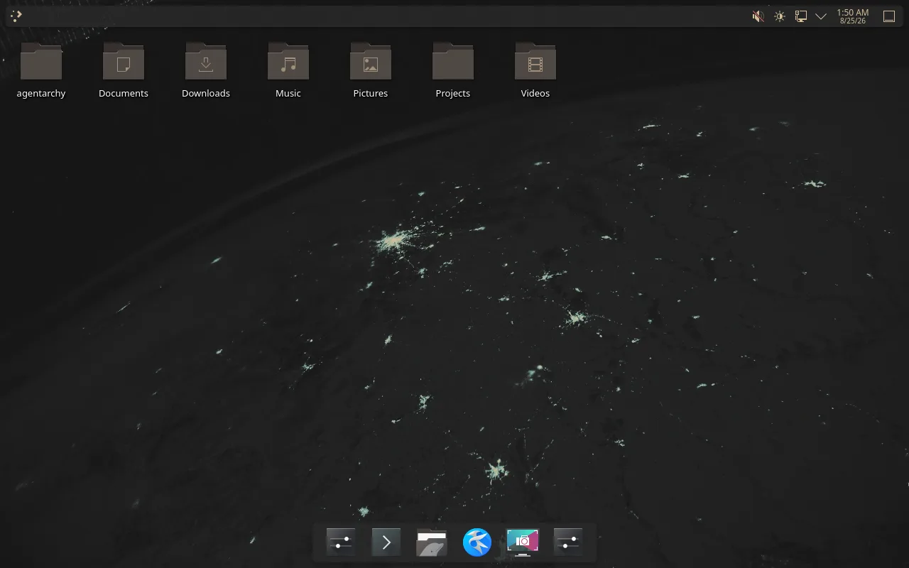
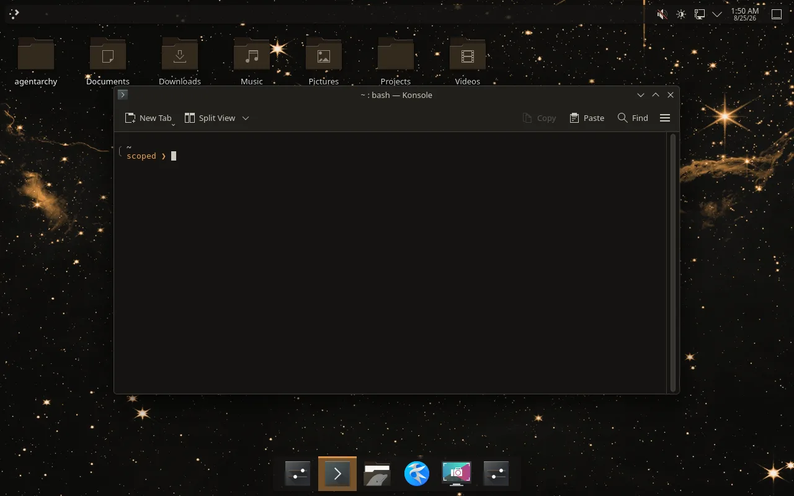
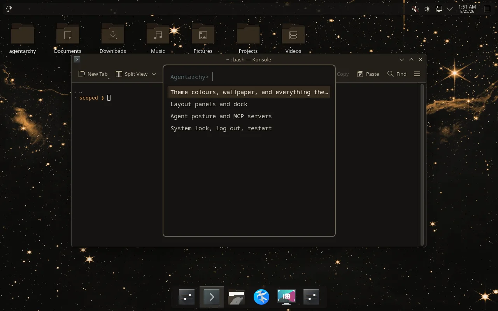
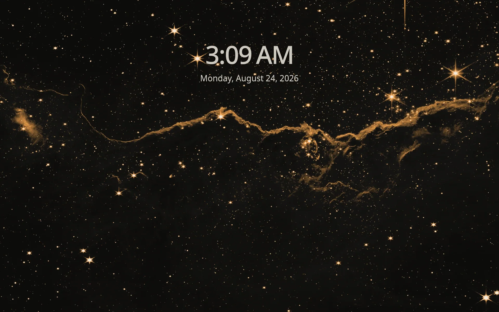
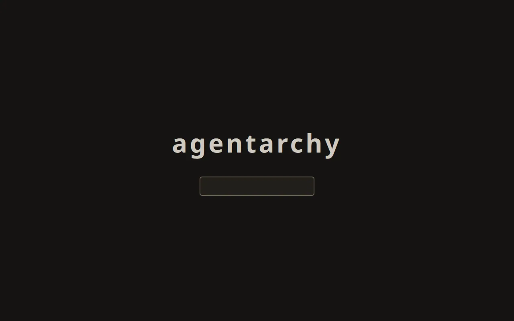

# Agentarchy

**Omarchy's tooling. A mouse-first desktop. Agents, eventually.**

Agentarchy is an Arch Linux distribution derived from [Omarchy](https://omarchy.org), on **KDE
Plasma 6** instead of Hyprland.



> **Status: pre-alpha.** What is described below exists and is tested. Anything that does not is on
> the [issue tracker](https://github.com/RFingAdam/agentarchy/issues) rather than in this paragraph,
> because a README that describes the roadmap in the present tense is how projects waste people's
> evenings.

## What actually works today

- A vanilla Arch cloud image becomes an installed, themed Plasma 6 Wayland session in about
  **six minutes**, unattended and reproducibly. `test/vm/golden-path` proves it on every change:
  14 stages, 91 assertions, a real reboot in the middle, and screenshots of the result.
- **The theme engine.** One `colors.toml` per theme drives 19 application templates: switching a
  theme retints Plasma, Konsole, the SDDM greeter, the lock screen, the icon set, the shell prompt,
  the menu, VS Code, helix, btop, tmux, foot and the rest, in one command. 21 themes ship, 2 of them
  light; the default is ours.
- **The login screen matches the machine**, on every install path. It is rendered from the same
  palette before the display manager starts, so it does not depend on which installer ran.
- **The desktop is arranged, not just painted.** Two panel layouts (`oal-layout-set ubuntu|mint`)
  and a menu on `Meta+Space` covering themes, layouts, agent posture and session actions. It lists
  only entries whose command actually exists on this tree, which a test enforces -- it replaced a
  menu where none of them did.
- **The agent layer.** MCP servers managed like packages, a permission posture that is a machine
  setting, a fail-closed guard on every tool call with an audit log, and a contract for an OS-level
  brain. That is the next section, and it is the part worth switching for.
- **A browser**, Chromium, set as the default handler. `oal-install-browser brave|firefox|zen` swaps
  it; the Chromium-based ones inherit the same theming and flags.
- Wallpapers derived from public-domain photography and recoloured per palette, with every file
  accounted for in `NOTICE`.

## What it looks like

One `colors.toml` per theme drives the whole surface, so switching a theme moves the desktop, the
panel, the icon set, the terminal, the menu, the lock screen and the login screen together. Every
image below is taken by `test/vm/golden-path` from a real install, on the run that gated this commit.

The default theme, and gruvbox:

| | |
|---|---|
|  |  |

The prompt and the menu. The prompt's second line is the agent state -- posture, model, registered
MCP servers, spend against today's limit -- and it prints nothing when there is nothing to say. The
menu is on `Meta+Space`:

| | |
|---|---|
|  |  |

The lock screen and the login screen. The greeter runs as the `sddm` user before any session exists,
so it cannot read the theme the way everything else does; its palette is rendered into it before the
display manager starts:

| | |
|---|---|
|  |  |

Wallpapers are public-domain NASA photography recoloured to each palette, so a theme change moves the
background too rather than leaving one picture under twenty-one colour schemes. `NOTICE` credits
every source.

## What came from Omarchy, and why you cannot see it

668 files and 302 `oal-*` commands: the theme engine (33), application installers (25), hardware
helpers (24), update and removal tooling (40), the system menu (10), plus audio, Plymouth,
notification and package wrappers.

None of it is visible on the desktop yet, and that is worth explaining rather than glossing.
Everything **visible** in Omarchy is Hyprland and Quickshell -- the bar, the launcher, the window
management, the on-screen menus. All of it was deliberately left behind (121 excluded scripts,
`shell/**`, `config/hypr/**`), because none of it applies to Plasma. What was kept is the layer
underneath the shell, and most of it has no route to the screen until the menu and layout land.
83 commands still need porting; `upstream/NEEDS-PORT.txt` lists them.

So: the theme engine is real and working. The rest is inherited machinery waiting for a front end.

## Agents are part of the OS, not something you bolt on

This is the part worth switching for, and the part no other distribution does.

**Ask the machine what is wrong with it, and it answers from facts.** Not from what a model
remembers about operating systems:

```bash
oal-doctor              # failed units, journal errors, OOM kills, disk, thermals,
                        # pending updates, .pacnew files, network, GPU driver, agent layer
oal-doctor --json       # the same report, for something that is not a person
```

`Meta+A` and `oal-brain-ask` attach that report to any question about this machine before it reaches
a model. Whether a question is about this machine is a keyword match rather than a model call, so it
is cheap, testable, and cannot itself hallucinate. It works offline, and it is the difference between
an assistant that is on your desktop and one that is *of* it.

**Any agent gets the same thing, over MCP.** `oal-mcp-serve` exposes the machine to whatever client
you run: `os_status`, `os_state`, `os_units`, `os_logs`, `os_packages`, `os_devices`, `os_tasks`
read-only, and one write tool that goes through the four-verb contract and the guard.

```bash
oal-mcp-install agentarchy
```

That is the answer to "why run my agent here rather than on Ubuntu": on this machine it can see the
machine, and every action it takes is checked.

**When something breaks, the desktop notices.** `oal-watch` runs the health report on a timer and
raises a notification for findings that are *new* -- clicking it hands that one finding, plus a skill
describing how to investigate it, to whichever agent is configured. A core dump takes the same path.
Only transitions are announced, because a watcher that repeats itself is one people turn off.
[docs/events.md](docs/events.md).

**MCP servers are managed like packages** -- not a JSON file you hand-edit and hope you got right:

```bash
oal-mcp-list                     # the catalog, and what is already registered
oal-mcp-install --profile dev    # install and register a set
oal-mcp-status                   # what is registered, and where it came from
oal-mcp-remove playwright        # not a one-way door
```

The shipped catalog is small and vendor-neutral on purpose: the reference servers and a few widely
used ones. Nothing is installed by default. `oal-mcp-import` registers a catalog of your own, so
private, licence-gated or hardware-bound servers need no change here and never appear in this
repository.

**The permission posture is a machine setting, and it is not one vendor's.**
`oal-agent-profile trusted|scoped|untrusted`, with `scoped` the default: reading and searching are
free, writing and installing are confirmed, and every posture refuses to read `.env` files and
private keys. It fails closed and writes one audit log for the whole machine.

The decision engine names no runtime and the policy lives in `default/guard/rules`. Claude Code
reaches it through its PreToolUse hook; anything else reaches the same answers through `oal-guard`,
which takes a tool name and some text and answers in its exit code:

```bash
echo "sudo pacman -Syu" | oal-guard --tool Bash
# ask	confirm	needs confirmation, or a CONFIRM-<8 hex> token in the call
```

Honest limit: a runtime is gated once something calls the guard before its tool calls. Claude Code
has a hook for that and is wired by the install. For anything without one, `oal-guard` is the
mechanism and the wiring is yours -- [docs/agent-guard.md](docs/agent-guard.md).

**The prompt shows what the agent is doing** -- model, posture, MCP servers registered, and how much
of today's limit is gone. It is rendered from the same `colors.toml` as the desktop, so it follows
the theme:

```
╭ ~/projects/agentarchy  main *
╰ opus-5  scoped  9 mcp  38%  ❯
```

It reads a cached file and never the network, and prints nothing at all when there is nothing to say.
A prompt that stalls is worse than a prompt that is quiet.

**It can think without the internet.** `ollama` ships, wired to the brain contract as a backend like
any other, so `Meta+A` answers with no network, no account and no bill:

```bash
oal-brain-model --suggest             # sized to this machine's memory
oal-brain-model --pull qwen2.5:1.5b
oal-brain-backend local
```

It drives Ollama's HTTP API rather than `ollama run`, which is what makes it usable rather than
merely present: the CLI cannot be told to keep the model loaded between questions, when to stop
generating, or what its system prompt is, and those three were most of the wait.

The CPU build ships everywhere and the CUDA build swaps in on a machine with an NVIDIA GPU. Nothing
about this is specific to any vendor, which is rather the point of the next paragraph.

**There is a contract for an OS-level brain.** Not a coding agent you launch -- a process that is
already running, remembers, is reachable from somewhere other than the terminal you are sitting at,
and can act on the machine. Agentarchy ships the contract and thin adapters; it ships no brain,
installs none, and enables none.

```bash
oal-brain-backend --list        # adapters: stub, claude-code, local, hermes
oal-brain-backend claude-code   # choosing one is the entire opt-in
oal-brain-ask "what is using my disk"
oal-brain-do notify "Build finished"
```

What a brain may do to the machine is four verbs -- read state, set the theme, send a notification,
open an application -- and that number is the design, not a starting point. Every one goes through
the same guard as everything else, and the `confirm` tier is a refusal rather than a prompt, because
there is no person on that path to ask. A resident brain with tool access, reachable from a chat
application, is a security decision you are making deliberately;
[docs/brain.md](docs/brain.md) is written so you can make it with the facts.

**Still a plan:** the engineering MCP catalog that layers on top of this -- RF, EMC, PCB and lab-test
servers -- which is what the tagline's third clause points at.

## Why the commands are called `oal-*`

Opinions are like... -- everyone's got one. Omarchy is proudly opinionated; so are we, just
differently. Every Agentarchy command starts with `oal-` (`oal-theme-set`, `oal-menu`,
`oal-update`). Config lives in `~/.config/oal`, state in `~/.local/state/oal`.

## Relationship to Omarchy

Agentarchy vendors the desktop-agnostic parts of Omarchy (quattro branch, pinned in
`upstream/PIN`) and replaces the Hyprland/Quickshell shell with KDE Plasma. It is an
independent project, not affiliated with or endorsed by Basecamp or DHH. See `NOTICE`.

## Layout

| Path | What |
|---|---|
| `bin/` | `oal-*` commands (vendored + native) |
| `install/` | system/user install steps run by `oal-apply-system` / `oal-provision-user` |
| `default/`, `config/` | system-wide and per-user defaults |
| `etc/` | files installed under `/etc` (systemd, sddm, plymouth, sudoers.d, ...) |
| `agents/` | agent skills shipped with the distro |
| `applications/` | `.desktop` launchers and their icons |
| `themes/` | colour themes (`colors.toml` + assets) |
| `upstream/` | upstream pin, vendor manifest, rename rules, patches, reports -- see `upstream/README.md` |
| `test/` | bats unit tests and the VM golden path |

## Try it in a VM

Everything runs headless on a Linux host with KVM and QEMU; nothing touches your machine's desktop.

```
test/vm/golden-path                 # pristine Arch cloud image -> installed Agentarchy ->
                                    # reboot -> themed Plasma 6 Wayland session -> assertions
                                    # -> screenshots, in about six minutes
test/vm/golden-path --keep          # same, but leave the VM up to poke at
test/vm/vm-ssh                      # a shell in the guest
```

Evidence from each run lands in `.vm/artifacts/<timestamp>/`: `bootstrap.log`, `assertions.txt`,
`timings.txt` and two screenshots (one from QEMU's framebuffer, one from inside the session).
`test/vm/README.md` documents the harness, including how to watch the guest live over VNC.

This is deliberately not part of `bin/oal-dev-check`: CI runners have no VM, and a gate that cannot
run in CI is a gate that rots.

## Developing

```
bin/oal-dev-check                   # seven gates: shellcheck, bats, branding, notice,
                                    # gitleaks (history + worktree), vendor drift (what CI runs)
bin/oal-dev-sync-upstream --check   # verify the vendored tree matches upstream/PIN + patches (read-only)
bin/oal-dev-sync-upstream --apply   # re-vendor (writes into the tree)
```

Files listed in `upstream/VENDORED-FILES.txt` are owned by the sync and must not be hand-edited;
capture changes with `bin/oal-dev-upstream-patch`. `upstream/README.md` documents the whole
contract, including the runbook for bumping `upstream/PIN`.

## Licence

MIT. Derived work attribution in `NOTICE`.
